[](https://console.aws.amazon.com/amplify/home#/deploy?repo=[https://github.com/mmatouk/petstore-sample](https://github.com/aws-samples/avp-petstore-sample))
# Introduction

# Setup Guide
### Cognito:
1. Navigate to Amazon Cognito in the Console
2. Select the [petstoresample...] Cognito User Pool 
3. We will need to create 3 users in order to fully test the functionality of this application and the policies for authorization in Amazon Verified Permissions
    1. First create “abhi”. This user id is required in order to test the Customer-GetOrders policy which we will cover below in the Verified Permissions section of the setup guide.
        1. This user is hard coded as the order owner in this application for ease of this example
        2. 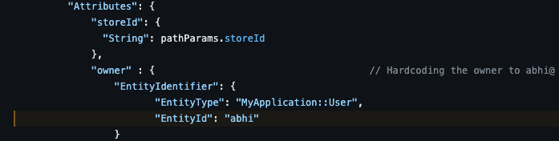
    2. You will want to define and validate the email and set a password as shown in the screenshot below
    3. 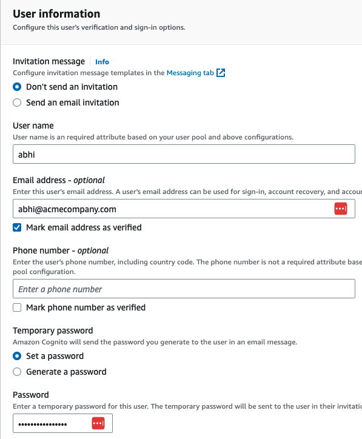
    4. Next create 2 more users. Their names can be whatever you would like.
        1. After you have created the 3rd user, go back in and edit the user in order to add a custom attribute
        2. 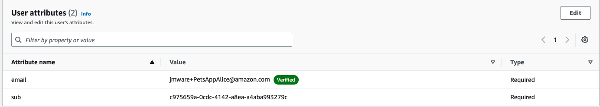
        3. Click “Add Attribute” at the bottom of the menu and configure as shown below
        4. 
4. Now we need to create groups and add these users to the appropriate ones.
    1. Under the groups tab in Cognito, click “create group”
    2. 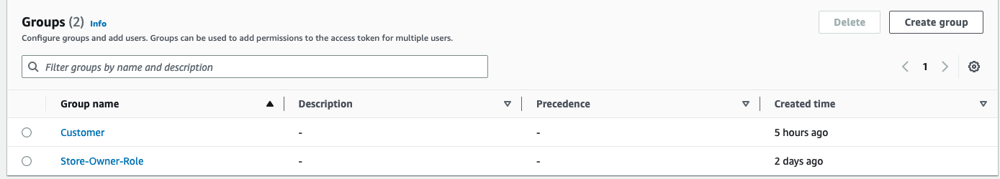
    3. You will need to create them as shown above as these attributes that are passed in the JWT are explicitly matched by the application in order to display the appropriate UI to the user. The Authorization decisions to leverage the API calls behind the buttons are still managed by Verified Permissions (You can validate this by adding the users to these groups and using the app without putting in the appropriate AuthZ policy in Verified Permissions. You will return a Deny).
    4. The “Customer” group needs to include “abhi” and the second user you created earlier
    5. The “Store-Owner-Role“ group should include the 3rd user you created earlier
5. Congratulations, Cognito is now configured correctly in order to fully validate this application.
### Amazon Verified Permissions:
#### Schema:
1. Navigate to Amazon Verified Permissions in the Console
2. Click on “Schema“ in the left menu
3. You will see a page like the following, click edit in the upper left section of the page.
4. 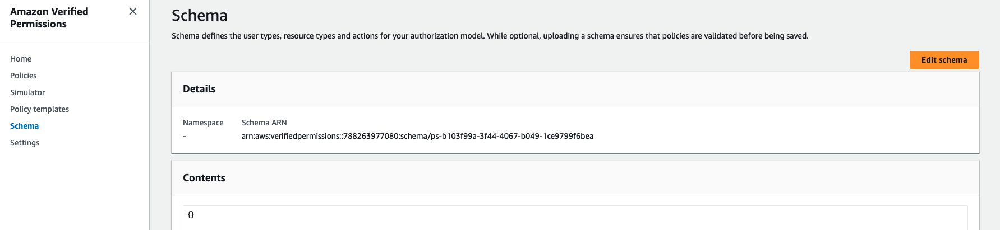
5. Delete the current contents, and paste in the following.
```
{
    "MyApplication": {
        "actions": {
            "GetOrder": {
                "appliesTo": {
                    "principalTypes": [
                        "User"
                    ],
                    "resourceTypes": [
                        "Order"
                    ]
                }
            },
            "GetStoreInventory": {
                "appliesTo": {
                    "principalTypes": [
                        "User"
                    ],
                    "resourceTypes": [
                        "Application"
                    ]
                }
            },
            "ListOrders": {
                "appliesTo": {
                    "principalTypes": [
                        "User"
                    ],
                    "resourceTypes": [
                        "Application"
                    ]
                }
            },
            "PlaceOrder": {
                "appliesTo": {
                    "principalTypes": [
                        "User"
                    ],
                    "resourceTypes": [
                        "Application"
                    ]
                }
            },
            "SearchPets": {
                "appliesTo": {
                    "principalTypes": [
                        "User"
                    ],
                    "resourceTypes": [
                        "Application"
                    ]
                }
            }
        },
        "entityTypes": {
            "Application": {
                "memberOfTypes": [],
                "shape": {
                    "attributes": {
                        "storeId": {
                            "name": "storeId",
                            "type": "String"
                        }
                    },
                    "type": "Record"
                }
            },
            "Order": {
                "memberOfTypes": [],
                "shape": {
                    "attributes": {
                        "owner": {
                            "name": "User",
                            "type": "Entity"
                        }
                    },
                    "type": "Record"
                }
            },
            "Pet": {
                "memberOfTypes": [],
                "shape": {
                    "attributes": {
                        "owner": {
                            "name": "User",
                            "type": "Entity"
                        }
                    },
                    "type": "Record"
                }
            },
            "Role": {
                "memberOfTypes": [],
                "shape": {
                    "attributes": {},
                    "type": "Record"
                }
            },
            "User": {
                "memberOfTypes": [
                    "Role"
                ],
                "shape": {
                    "attributes": {
                        "employmentStoreCode": {
                            "type": "String"
                        }
                    },
                    "type": "Record"
                }
            }
        }
    }
}
```
7. Click “save changes.”
#### Policies:
1. Now click on “Policies” in the left menu
2. You will need to add the following policies
Customer Role - Search Pets and Place Order
```
permit (
    principal in MyApplication::Role::"Customer",
    action in [MyApplication::Action::"SearchPets", MyApplication::Action::"PlaceOrder"],
    resource
);
```
Customer Role - Get Order
```
permit (
    principal in MyApplication::Role::"Customer",
    action in [MyApplication::Action::"GetOrder"],
    resource
) when {
    principal == resource.owner
};
```
Store Owner no store check
```
permit (
    principal in MyApplication::Role::"Store-Owner-Role",
    action in [
        MyApplication::Action::"GetStoreInventory",
        MyApplication:: Action::"ListOrders"
    ],
    resource == MyApplication::Application::"PetStore"
);
```
#### Update Policy Store ID for Authorizer:
1. Now navigate to the “Settings“ section along the left menu
2. Copy the Policy Store ID, we will need this to update the env variable in the Auth Lambda for the application to match your dev environment. 
3. Navigate to the Lambda Service
4. Select the [Petstoresample...] lamdba function and click the “configuration” tab.
5. 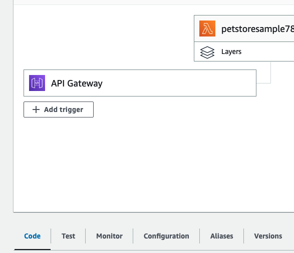
6. Next click on the environment variables along the left menu and edit to update the Policy Store ID to what you copied from you Verified Permissions Policy Store settings, and save.
7. Congratulations, Amazon Verified Permissions is now set and your application is ready for testing.
### Testing the Application:
1. Navigate to AWS Amplify and click on the petstore-sample application
2. 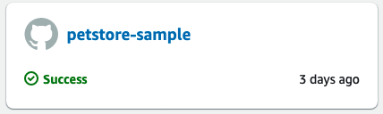
3. select the link under your front end of the application in order to launch in another Tab the Application UI.
4. 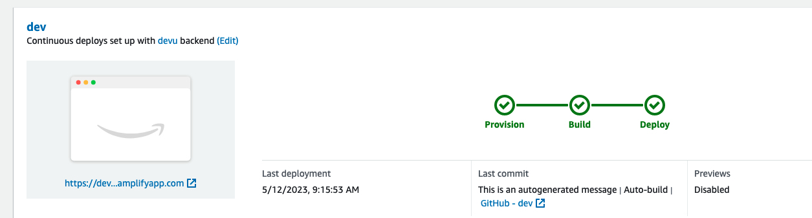
5. You should see a login screen like the one below.
6. 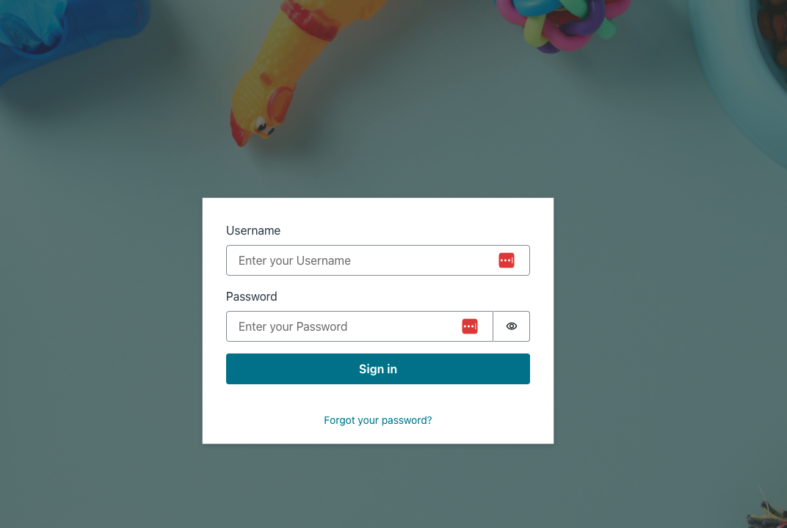
7. First login as abhi to see the full suite of API’s. 
    1. When you log in as a customer, you will see the “Customer role type actions“ menu. As you attempt each of the following actions, you will yield a result on the right side of the screen with a permit or deny decision from AVP and the corresponding reason. 
    2. 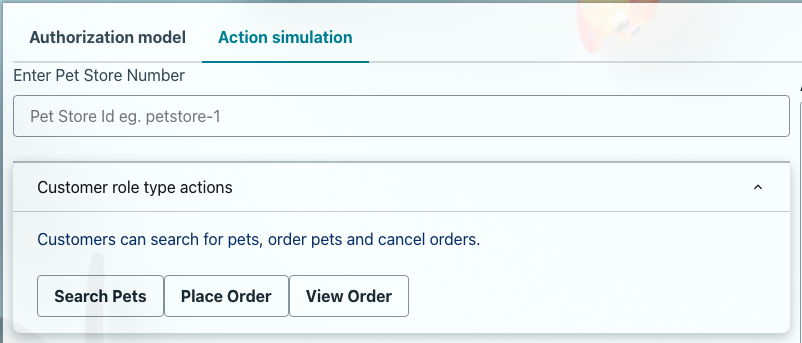
    3. Select, Search Pets, and see the result on the right side. Next try Place order and view the result again.
    4. As you select View Order, as abhi, you will yield a successful message like the one shown below, this is due to the fact that abhi is listed as the resource owner for the resource, order-1.
    5. 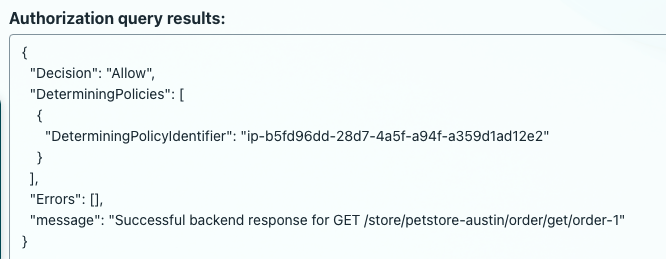
    6. Sign out of the abhi persona and lets move on to the next customer user.
8.  Sign in as the 2nd Customer user.
    1. When you sign in, you will see the same “Customer role type actions“ menu as we did with the abhi persona.
    2. Select, Search Pets, and see the result on the right side. Next try Place order and view the result again. As before you will see a corresponding success as shown below. 
    3. 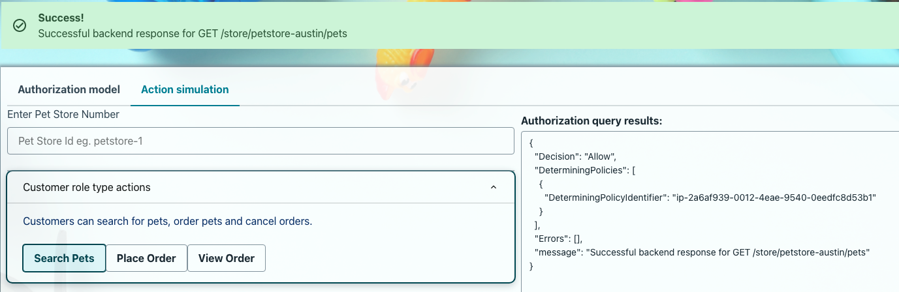
    4. Now as you try View Order, you will yield a failure message like the one shown below, this is due to the fact that customer user 2 is NOT listed as the resource owner for the resource, order-1.
    5. 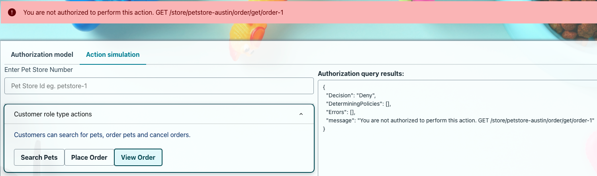
    6. Sign out of the customer 2 persona and lets move on to the store owner user.
9. Next, log in as the StoreOwner and assess your api access. Try with and without defining the petstore in the input field (options are: “petstore-london“ and “petstore-austin”).
    1. 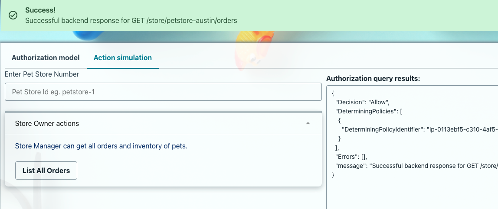
    2. Once you have tested each user and their access in the App, go back and change the Store Owner policy to match the one below in Amazon Verified Permissions.

Store Owner with store check
```
permit (
    principal in MyApplication::Role::"Store-Owner-Role",
    action in [
        MyApplication::Action::"GetStoreInventory",
        MyApplication:: Action::"ListOrders"
    ],
    resource == MyApplication::Application::"PetStore")
when { principal.employmentStoreCode == resource.storeId };

```
    1. Now when you try the application, if you put “petstore-austin” in the prompt box you will get a Deny and if you put “petstore-london” in the prompt box you will get an Allow. This is because the application is leveraging the “storeowner” attribute passed in the JWT to limit their access in accordance to the more restrictive Policy that identifies the specific store location the persona manages.
